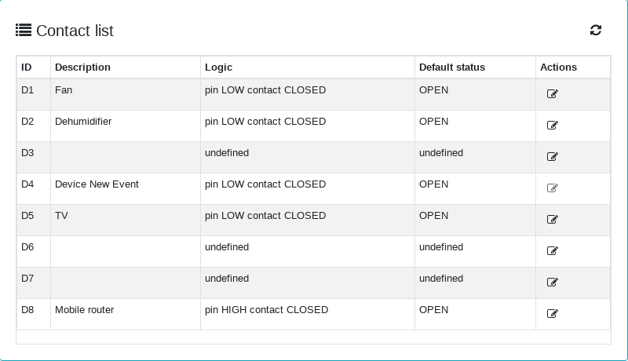
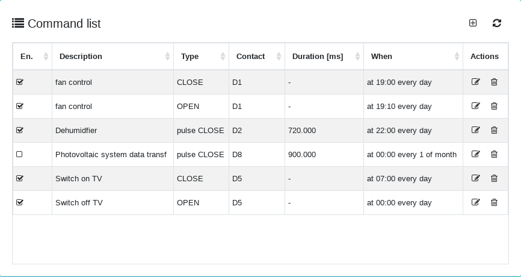
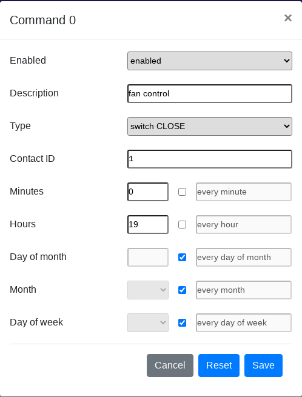

# SMART TIMER

A simple app based on [ESPBOT](https://github.com/quackmore/espbot_2.0) and WEMOS D1 Mini.

The timer allows to control up to 7 contacts.
Up to 30 commands can be defined to switch the contacts CLOSE or OPEN based on time and date.
Time and date precision is guaranteed by SNTP.

## Using the APP

### Configuring the contacts

Smart Timer uses WEMOS D1 Mini GPIO from D1 to D8.

D4 (connected to the WEMOS led) is reserved for signaling anomalies on the device. The led is switched on when an unexpected condition is met (e.g. WIFI disconnection, configuration errors, ...).

Each other GPIO can be configured using the web interface, connecting to the device with a browser.

Each contact can be assigned a description (31 chars), the logic (pin voltage LOW -> contact closed or pin voltage HIGH -> contact closed) and the default status (at boot) (OPEN or CLOSED).

### Contacts constraints

Please consider that using ESP8266 and WEMOS D1 Mini, as is, you will notice the following behavior on reset (and boot).

D1, D2, D5, D6, D7 voltage is high on reset and after (and obviously at boot), so the best way to use them is to set the logic as (pin voltage LOW -> contact CLOSED) and the default status as OPEN.

D3 voltage shows a low pulse at reset then goes high, better not use this GPIO as it will cause a contact pulse everytime the device is reset.

D8 voltage is low at reset and after (and obviously at boot), so the best way to use it is to set the logic as (pin voltage HIGH -> contact CLOSED) and the default status as OPEN.

### Defining the commands

Up to 30 commands can be configured using the web interface, connecting to the device with a browser.

Each command can be assigned:

- an 'enabled' flag, meaning you can define commands in advance and then avoid execution just disabling them
- a command description (up to 32 chars)
- the contact that has to be controlled
- the action to perform on the contact (OPEN, CLOSE, 'pulse OPEN' or 'pulse CLOSE')
- when a pulse action is selected the pulse duration in milliseconds
- the time and date the command has to be executed

### Setting execution time and date 'cron' style

Setting the command execution time and date looks like setting up a linux cron job.

Here are some examples:

    minutes        0
    hours          9
    day of month   * (every day of month)
    month          * (every month)
    day of week    * (every day of week)       -> at 09:00 every day 
    
    minutes        0
    hours          9
    day of month   * (every day of month)
    month          * (every month)
    day of week    Sunday                      -> at 09:00 every Sunday 

    minutes        0
    hours          9
    day of month   1
    month          *
    day of week    * (every day of week)       -> at 09:00 every 1 st day of month 

### Building the binaries and flashing ESP8266

Required:

- [Espressif NON-OS SDK] (<https://github.com/espressif/ESP8266_NONOS_SDK)> in a separate repository.
- [esp-open-sdk toolchain] (<https://github.com/pfalcon/esp-open-sdk)> in a separate repository; build the bare Xtensa toolchain and leave ESP8266 SDK separate using:

      make STANDALONE=n

Build steps (linux)

- Clone the repository.
- Customize build variables according to your ESP8266 module and environment:

      cd <your path>/smart_timer
      ./gen_env.sh

      this will generate a env.sh file
      for instance a WEMOS D1 mini file will look like this:
      
      export SDK_DIR=<your path to ESP8266_NONOS_SDK>
      export COMPILE=gcc
      export BOOT=new
      export APP=1
      export SPI_SPEED=40
      export SPI_MODE=DIO
      export SPI_SIZE_MAP=4
      export COMPILE=gcc
      export COMPORT=<your COM port>
      export CC_DIR=<your path to compiler>
      export PATH=$PATH:<your path to compiler>
      export SDK_DIR=<your path to ESP8266_NONOS_SDK>
      export BOOT=new
      export APP=1
      export SPI_SPEED=40
      export FREQDIV=0
      export SPI_MODE=dio
      export MODE=2
      export SPI_SIZE_MAP=6
      export FLASH_SIZE=4096
      export LD_REF=2048
      export FLASH_OPTIONS=" write_flash -fm dio -fs 32m-c1 -ff 40m "
      export FLASH_INIT="0x3FB000 <your path to ESP8266_NONOS_SDK>/bin/blank.bin 0x3FC000 <your path to ESP8266_NONOS_SDK>/bin/esp_init_data_default_v08.bin 0x3FE000 <your path to ESP8266_NONOS_SDK>/blank.bin"

- Building (commands available as tasks in case you are using Visual Studio)
  
  Clean project
  
      source ${workspaceFolder}/env.sh && make clean

  Building current user#.bin

      source ${workspaceFolder}/env.sh && make all

  Building user1.bin
  
      source ${workspaceFolder}/env.sh && make -e APP=1 all

  Building user2.bin
  
      source ${workspaceFolder}/env.sh && make -e APP=2 all

  Building both user1.bin and user2.bin
  
      source ${workspaceFolder}/env.sh && make -e APP=1 all && make -e APP=2 all

## Setup the device

### Flashing

(flash commands are also available as VS tasks)

Flashing ESP8266 using esptool.py (checkout your distribution packages or [github repository](https://github.com/espressif/esptool)) (commands available as tasks in case you are using Visual Studio)
  
  Erase flash
  
      source ${workspaceFolder}/env.sh && make flash_erase

  Flash the bootloader
  
      source ${workspaceFolder}/env.sh && make flash_boot

  Flash init
  
      source ${workspaceFolder}/env.sh && make flash_init

  Flash current user#.bin
  
      source ${workspaceFolder}/env.sh && make flash

  Flash user1.bin
  
      source ${workspaceFolder}/env.sh && make -e APP=1 flash

  Flash user2.bin
  
      source ${workspaceFolder}/env.sh && make -e APP=2 flash

### Wifi setup

- wifi connection: without configuration the ESP device will work as a Wifi AP with SSID=ESPBOT-chip_id and password=espbot123456

      curl --location --request POST 'http://{{host}}/api/wifi/cfg' \
      --data-raw '{
          "station_ssid": "your_Wifi_SSID",
          "station_pwd": "your_Wifi_password"
      }
  this will make the device stop working as AP and connect to your Wifi AP

### Uploading web server files

Use the [espUploadFile](https://github.com/quackmore/esp_utils) bash script to upload files to the ESP8266 device

- cd to web directory and upload each file to the device running the following command
- espUploadFile filename 'your device IP address'

### Minimum device configuration

Smart Timer requires following minimum configuration (using the web interface)

- cron 'enabled'
- SNTP 'enabled' (for time precision)

## License

The app comes with a [BEER-WARE] license.

Enjoy.
